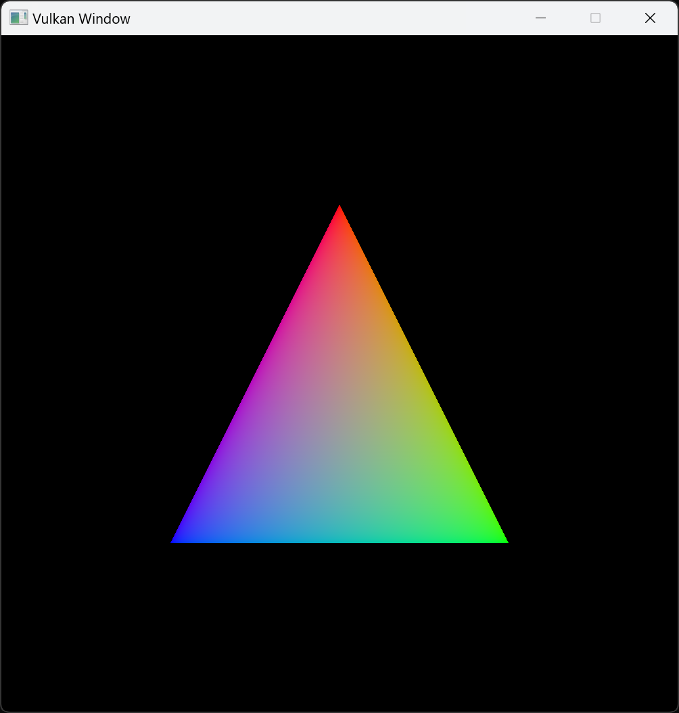
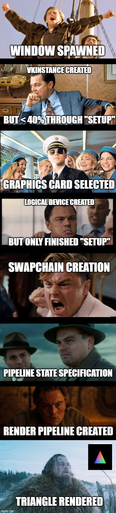

# Vulkan Rainbow Triangle in Odin and GLFW

This is a "minimal" example of a Vulkan app in Odin which renders a rainbow triangle.

## Build

The code in `rainbow-triangle.odin` can be compiled and ran from a terminal
with the SINGLE command:

`odin run rainbow-triangle.odin -file -o:speed`

The code can be compiled and ran in debug mode with

`odin run rainbow-triangle.odin -file -debug`

which in particular (by default) prints out information throughout the setup process.

## Summary of first-time working with Vulkan

